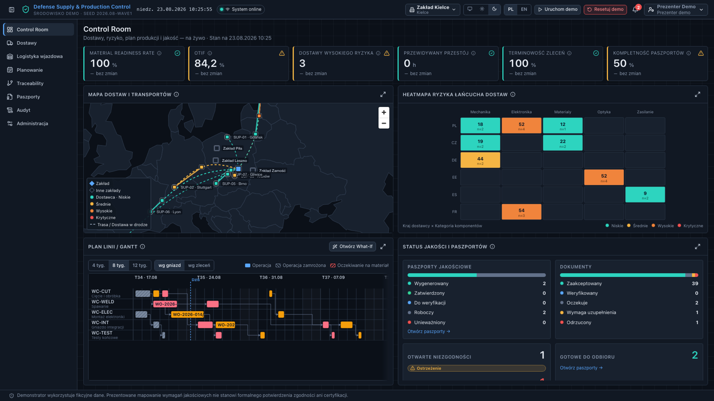
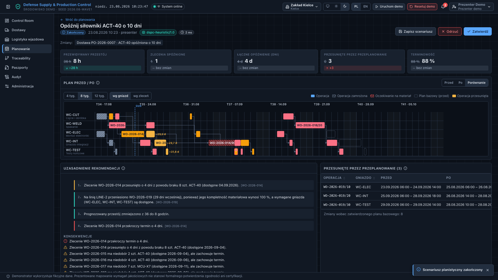
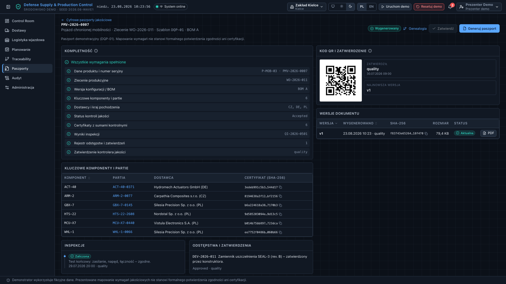
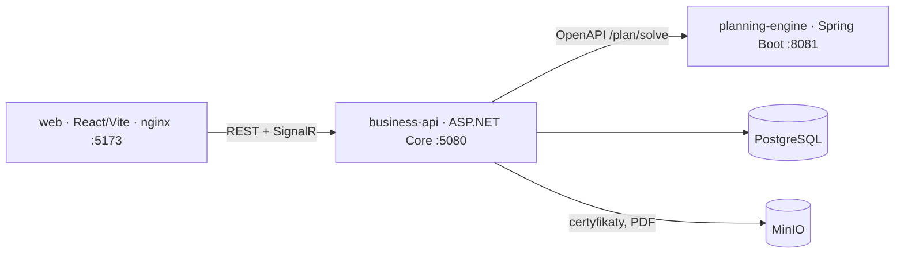

# Defense Supply & Production Control — demonstrator targowy

> **Demonstrator wykorzystuje fikcyjne dane. Prezentowane mapowanie wymagań jakościowych nie stanowi formalnego potwierdzenia zgodności ani certyfikacji.**
> *This demonstrator uses fictional data. The quality-requirement mapping shown is not a formal statement of conformity or certification.*

Łączymy zewnętrznych dostawców z wewnętrznym planem produkcji: portal kooperanta → wyjaśnialna ocena ryzyka dostaw → dynamiczny MRP i symulacje What-If → genealogia partii → cyfrowy paszport jakościowy (PDF, QR, SHA-256). Całość działa lokalnie, offline, z Docker Compose.

## Jak to wygląda



*Control Room: sześć KPI liczonych z danych, mapa dostaw bez internetu, heatmapa ryzyka, Gantt i status paszportów.*



*Symulacja What-If: jeden Gantt z planem przed i po, przestój 36 h → 8 h, uzasadnienia wyliczone z danych scenariusza.*



*Cyfrowy paszport jakościowy: kompletność wg szablonu DQP-01, kod QR, wersje dokumentu z sumami SHA-256.*

Pełna galeria z opisami — w tym portal kooperanta, genealogia partii, cztery zakłady i widoki mobilne:
[`docs/screenshots/`](docs/screenshots/README.md).

## Quick Start

Wymagania: Docker Desktop (Compose v2), ~4 GB RAM dla kontenerów, wolne porty 5173, 5080, 8081, 5432, 9000/9001 (wszystkie bindowane do `127.0.0.1`).

```bash
git clone <repo> dspc && cd dspc
cp .env.example .env          # wartości demonstracyjne
./scripts/start.sh            # build + start + health wait + smoke test
```

Windows (PowerShell):

```powershell
Copy-Item .env.example .env
.\scripts\start.ps1
```

Równoważnie (bez skryptu): `docker compose --profile demo up --build`.

Aplikacja: **http://localhost:5173** (auto-login jako `DemoPresenter`). API/OpenAPI: http://localhost:5080/swagger. Silnik planowania: http://localhost:8081/actuator/health. MinIO console: http://localhost:9001.

Reset danych: przycisk **Resetuj demo** w pasku górnym lub `./scripts/reset-demo.sh` (< 10 s).

## Scenariusz targowy (4–5 min)

Pełny skrypt: [`docs/demo-script/presenter.md`](docs/demo-script/presenter.md). W skrócie: Control Room → jako dostawca `supplier.hydromech` przesuń ETA `ACT-40` o +10 dni → ryzyko 44 → 79 (krytyczne), `WO-2026-014` zagrożone, prognozowany przestój 36 h → What-If „Opóźnij siłowniki ACT-40 o 10 dni” → plan Przed/Po: `WO-2026-019` wciągnięte na gniazdo integracji, przestój 36 → 8 h → Zatwierdź → traceability `PMV-2026-0007` → partia `HTS-22-2608` → paszport PDF jednym kliknięciem.

## Konta demonstracyjne (hasło `demo`)

`presenter` (DemoPresenter), `planner` (ProductionPlanner), `inbound` (InboundCoordinator), `quality` (QualityInspector), `director` (OperationsDirector), `auditor` (Auditor), `admin` (Administrator), `supplier.hydromech` / `supplier.nordstal` / `supplier.vistula` (SupplierUser — widzą tylko własne dane). Szczegóły: [`docs/demo-script/accounts.md`](docs/demo-script/accounts.md). W profilu `demo` menu użytkownika pozwala przełączać role bez hasła.

## Architektura



- `apps/business-api` — modularny monolit .NET 10 (Suppliers, Inbound, Risk, Inventory, Production, Planning, Quality, Traceability, Documents, Passports, Identity, Audit, Dashboard, Demo), EF Core + PostgreSQL, transactional outbox → SignalR, JWT + RBAC egzekwowany w API, audyt append-only.
- `apps/planning-engine` — bezstanowy, deterministyczny silnik MRP/re-harmonogramowania (Java 17, Spring Boot), twarde ograniczenia + ważona funkcja celu, limit czasu, fallback po stronie .NET (`Heuristic fallback`).
- `apps/web` — React 19 + TypeScript, TanStack Query, MapLibre (lokalny GeoJSON, bez internetu), własny Gantt SVG z trybem Przed/Po, i18n PL/EN, WCAG 2.2 AA na kluczowych ścieżkach.
- `packages/contracts` — kontrakt OpenAPI silnika + przykładowe scenariusze; `packages/demo-data` — deterministyczny seed (daty względem poniedziałku bieżącego tygodnia).

Dokumentacja: [przegląd i decyzje](docs/architecture/overview.md) · [ADR](docs/adr) · [model ryzyka](docs/architecture/risk-model.md) · [silnik planowania: ograniczenia i funkcja celu](docs/architecture/planning-engine.md) · [liczby scenariusza demo](docs/architecture/demo-scenario.md) · [API](docs/api/endpoints.md) · [demonstrator vs produkcja](docs/architecture/demo-vs-production.md) · [SECURITY.md](SECURITY.md) · [licencje](docs/licenses.md) · [troubleshooting](docs/troubleshooting.md).

## Praca deweloperska

Polecenia per aplikacja i uruchamianie pojedynczych testów: [`DEVELOPMENT.md`](DEVELOPMENT.md) oraz README w `apps/*`. Profil `dev` (`docker compose --profile dev up`) uruchamia tylko Postgres, MinIO, silnik i API — frontend z `pnpm dev` (proxy na :5080).

## Testy

| Warstwa | Zakres | Polecenie |
|---|---|---|
| .NET | formuła ryzyka, ocena wpływu na plan, izolacja dostawców i RBAC, ETA → ryzyko → zdarzenia → audyt, reset demo, KPI, kompletność i unieważnianie paszportu, integracja z PostgreSQL (Testcontainers) | `cd apps/business-api && dotnet test` |
| Java | twarde ograniczenia, scenariusz `ACT-40 +10 dni`, brak podwójnego obciążenia, operacje zamrożone, fallback, determinizm, kontrakt | `cd apps/planning-engine && ./mvnw test` |
| Web | komponenty, zmiana roli, stany loading/error/empty, formatowanie KPI, Gantt Przed/Po, scenariusz, genealogia, paszport | `cd apps/web && pnpm test` |
| E2E | ścieżka targowa end-to-end + smoke po starcie Compose | `cd tests/e2e && pnpm test` |

Wyniki ostatniego uruchomienia: sekcja „Status” poniżej.

## Status implementacji

Zaimplementowane i zweryfikowane na uruchomionym środowisku Compose:

| Obszar | Stan |
|---|---|
| Control Room (KPI, mapa offline, heatmapa, Gantt, jakość, focus mode) | gotowe |
| Portal kooperanta (zamówienia, statusy, partie, ETA, dokumenty, awizacje, izolacja danych) | gotowe |
| Ocena ryzyka dostaw (regułowa, wyjaśnialna, „Dlaczego ten wynik?”) | gotowe |
| Logistyka wjazdowa i symulator zdarzeń | gotowe |
| MRP i What-If (5 scenariuszy + własny, Przed/Po, zatwierdzanie planu) | gotowe |
| Silnik planowania (Java, deterministyczny, fallback `Heuristic fallback`) | gotowe |
| Traceability (trace-back/forward, genealogia, blokada partii) | gotowe |
| Cyfrowy paszport jakościowy (kompletność, PDF, QR, SHA-256, wersjonowanie, unieważnianie) | gotowe |
| RBAC w API, audyt append-only, outbox + SignalR, powiadomienia | gotowe |
| Tryb demo: auto-login, przełącznik ról, panel prezentera, reset | gotowe |
| Motyw jasny/ciemny/auto, PL/EN, zwijane menu | gotowe |
| Opcjonalne wspomaganie AI (`LOCAL_AI_ENABLED`) z deterministycznym symulatorem | gotowe |

Wyniki testów (ostatnie pełne uruchomienie):

| Warstwa | Wynik |
|---|---|
| .NET (`dotnet test`) | 89 / 89 |
| Java (`./mvnw test`) | 27 / 27 |
| Web (`pnpm test`) | 49 / 49 |
| E2E (`pnpm test` w `tests/e2e`, na kontenerach) | 15 / 15 |

Zmierzone na uruchomionym środowisku: scenariusz `ACT-40 +10 dni` — ryzyko 44 → 79 (krytyczne), przestój 36 → 8 h, `WO-2026-014` spóźnione o 4 dni, `WO-2026-019` wciągnięte o 29 dni na gniazdo integracji, czas solvera 2–5 ms; reset demo 0,6–2,3 s; paszport PDF ok. 81 kB, 2 strony.

## Znane ograniczenia

- Demonstrator, nie produkt: dane fikcyjne, brak certyfikacji i formalnej oceny zgodności (AQAP/ISO/STANAG).
- Profil `demo` celowo osłabia uwierzytelnianie (auto-login, przełącznik ról, reset) i nie może być wystawiony poza `127.0.0.1`; produkcyjnie wymaga OIDC/MFA (`Demo__Enabled=false` wyłącza te endpointy).
- Komunikacja wewnątrz Compose po HTTP, bez TLS; sekrety demonstracyjne w `.env.example`.
- `IFileScanner` to bezpieczny mock — brak realnego skanowania antywirusowego.
- Jeden zakład, jedna strefa czasowa, horyzont 12 tygodni; solver heurystyczny (nie CP-SAT), zoptymalizowany pod dane demonstracyjne.
- Scenariusze uruchamiane w kolejce w procesie API — restart API w trakcie przeliczania zostawia scenariusz w stanie `Running`.
- W trybie `Heuristic fallback` plan „Po” jest równy planowi „Przed” (heurystyka lokalna nie wciąga zleceń do przodu).
- Brak kopii zapasowych, HA i retencji dla PostgreSQL/MinIO.
- QuestPDF na licencji Community — przy zastosowaniu komercyjnym zweryfikuj próg przychodowy (`docs/licenses.md`).
- Etykiety dostawców na mapie mogą się nakładać przy dużym zagęszczeniu (np. Gliwice/Kraków).
