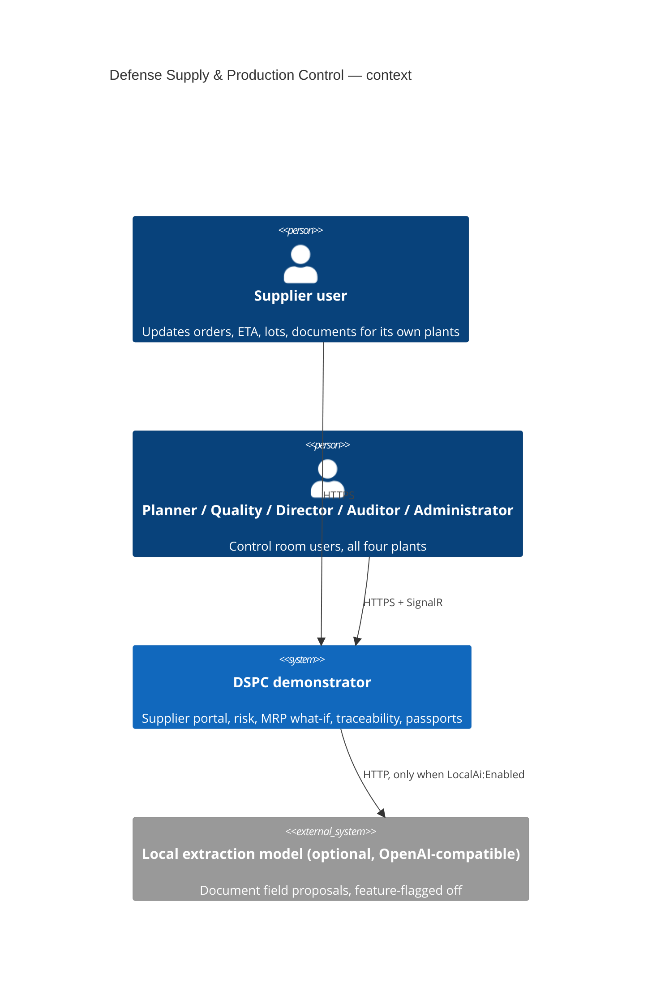
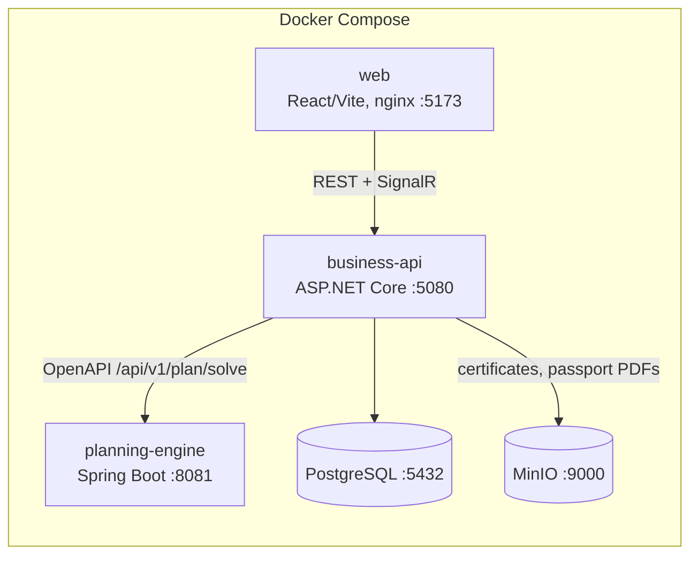

# Architecture overview

## Decisions

Each significant decision has its own record in [`../adr/`](../adr/); this table is only an index, so the reasoning
lives in exactly one place.

| # | Decision | Record |
|---|---|---|
| 0001 | Modular monolith in .NET + separate stateless Java engine | [modular-monolith](../adr/0001-modular-monolith.md) |
| 0002 | Local JWT identity instead of Keycloak; OIDC is a config swap | [local-jwt-identity](../adr/0002-local-jwt-identity.md) |
| 0003 | Transactional outbox for domain events, dispatched to handlers and SignalR | [transactional-outbox](../adr/0003-transactional-outbox.md) |
| 0004 | Seed-relative clock (T0 = Monday of the current week) and deterministic ids | [seed-relative-clock](../adr/0004-seed-relative-clock.md) |
| 0005 | Scenario changes applied to the problem, queued execution, deterministic fallback | [scenario-execution-and-fallback](../adr/0005-scenario-execution-and-fallback.md) |
| 0006 | Passport completeness as a pure rule; versioned PDFs; invalidation on lot block | [passport-generation-and-invalidation](../adr/0006-passport-generation-and-invalidation.md) |
| 0007 | Plant scoping through one resolver (`ISiteContext`), suppliers reach only plants they supply | [multi-site-scoping](../adr/0007-multi-site-scoping.md) |
| 0008 | One definition of "moved operations" on the What-If screen | [moved-operations-semantics](../adr/0008-moved-operations-semantics.md) |

Two constraints shape almost everything else and are not ADRs because they come from the specification:

- **Offline.** No tile server, no CDN, no external font or model call on the critical path. The map is a local
  GeoJSON outline; the optional local-model adapter is feature-flagged off and never gates a demo step.
- **Explainable, not predictive.** Risk is a weighted rule set ([risk-model](risk-model.md)) and solver output is
  reason codes plus parameters, localised in the UI — the API never ships prose.

## Further reading

[Four plants and their scenarios](multi-site.md) · [Kielce seed numbers](demo-scenario.md) ·
[Engine constraints and objective](planning-engine.md) · [Responsive contract](responsive.md) ·
[Demonstrator vs production](demo-vs-production.md) · [API surface](../api/endpoints.md)
