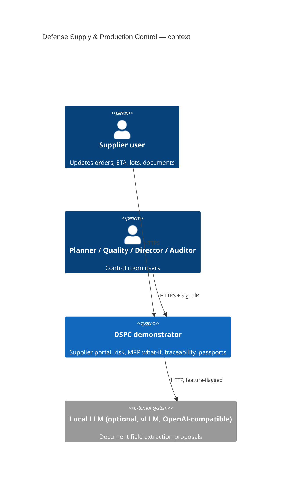
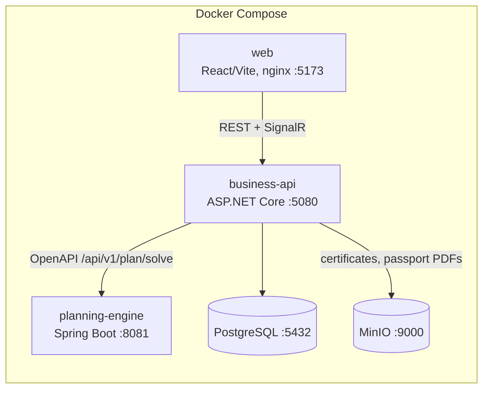

# Architecture overview

## Decisions (see `docs/adr/`)

1. **Modular monolith in .NET, separate Java engine** — spec requirement; engine is stateless so Compose reliability stays high. Planning request/response JSON persisted in Postgres for audit.
2. **Custom deterministic heuristic instead of OptaPlanner/Timefold** — same input ⇒ same output, sub-second on demo data, no solver warm-up, no licence questions.
3. **Local JWT identity in business-api** (no Keycloak) — `Identity:LocalProvider`. Compose stays 5 containers; the auth abstraction (`ITokenIssuer`, standard JWT bearer validation) swaps to OIDC by config. Demo profile adds `demo-login` for role switching.
4. **Transactional outbox** — `OutboxMessage` written in the same `SaveChanges`; `OutboxDispatcher` hosted service delivers to in-process handlers (risk re-scoring, passport invalidation, notifications) and SignalR. Broker can be attached later behind `IEventPublisher`.
5. **Seed-relative clock** — all demo dates are offsets from Monday of the current week so the demo looks live and resets identically.
6. **Baseline is hand-placed in seed**, engine minimises change from it; What-If "Before" = baseline + scenario change without re-sequencing (shows the pain), "After" = engine proposal.
7. **Explanations are reason codes + params**, localised in the UI, never solver free-text.
8. **PDF via QuestPDF (Community licence)**, QR via QRCoder, SHA-256 stored per `PassportVersion`; files in MinIO (or filesystem in dev).
9. **Map without internet** — MapLibre GL with a local GeoJSON Europe outline + supplier/site points; no raster tiles.
