# Galeria zrzutów ekranu

Wszystkie zrzuty pochodzą z uruchomionego demonstratora (Docker Compose, dane po `./scripts/reset-demo.sh`)
i pokazują **fikcyjne dane demonstracyjne**. Kolejność odpowiada scenariuszowi targowemu
z [`docs/demo-script/presenter.md`](../demo-script/presenter.md).

Zrzuty odtworzysz po dowolnej zmianie w interfejsie:

```bash
docker compose --profile demo up -d      # stack musi działać
node docs/screenshots/capture.mjs        # z katalogu głównego repozytorium
```

Skrypt sam resetuje dane, przechodzi scenariusz krok po kroku i na końcu przywraca stan początkowy.

---

## 1. Punkt wyjścia — spokojny Control Room


Pełny obraz sytuacji na jednym ekranie 1920×1080: sześć KPI liczonych z danych, mapa dostaw działająca
bez internetu (lokalny GeoJSON), heatmapa ryzyka w układzie kraj × kategoria komponentu, Gantt planu linii
i status paszportów. Wszystko zielone lub bursztynowe — to stan, od którego zaczyna się prezentacja.

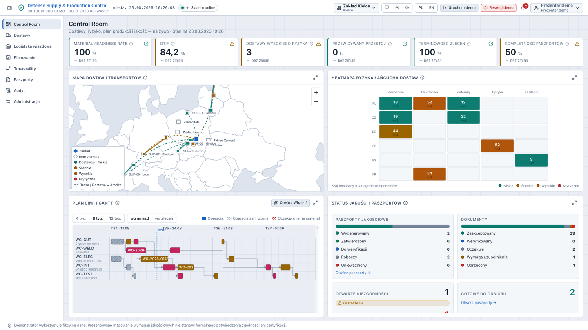

Ten sam ekran w motywie jasnym. Przełącznik w pasku górnym ma trzy stany (auto / jasny / ciemny), a wybór
jest zapamiętywany — na stoisku z mocnym oświetleniem jasny motyw bywa czytelniejszy.

---

## 2. Zdarzenie — dostawca przesuwa ETA

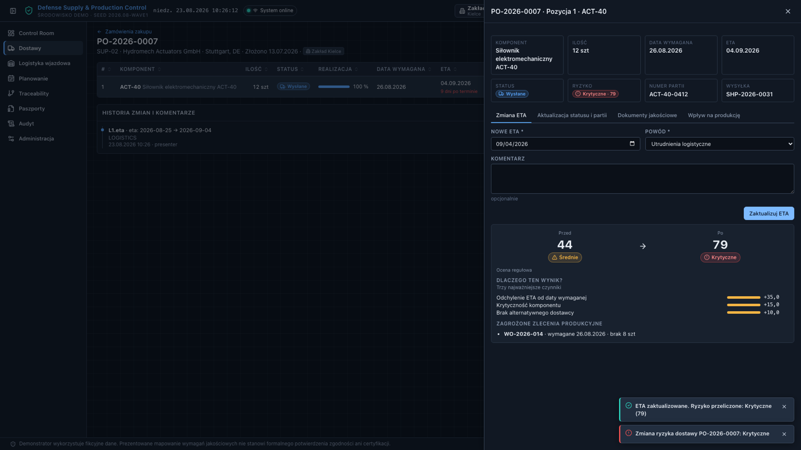

Dostawca sam aktualizuje termin w portalu kooperanta. System natychmiast przelicza ryzyko dostawy
**44 → 79 (krytyczne)**, pokazuje trzy najważniejsze czynniki („Dlaczego ten wynik?") i wskazuje zagrożone
zlecenie produkcyjne `WO-2026-014` wraz z wielkością braku. Ocena jest **regułowa i wyjaśnialna** — nie jest
prezentowana jako predykcja AI.

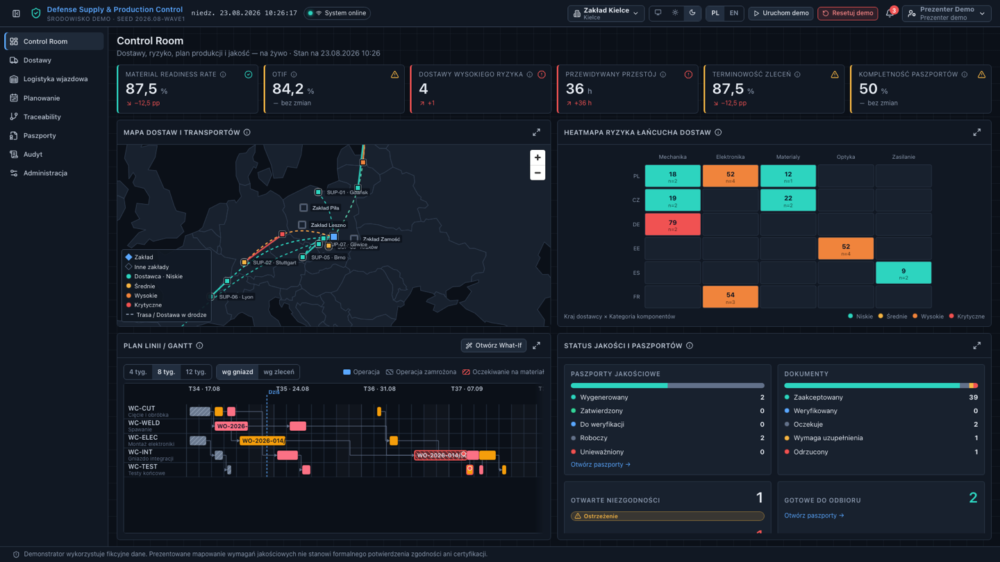

Pulpit reaguje na żywo (SignalR), bez odświeżania strony: dostawy wysokiego ryzyka 3 → 4, przewidywany
przestój 0 → **36 h**, gotowość materiałowa 100 → 87,5 %, komórka DE na heatmapie robi się czerwona,
a Gantt oznacza `WO-2026-014` jako zagrożone.

---

## 3. Decyzja — symulacja What-If i plan Przed / Po


Silnik MRP przelicza scenariusz w kilka milisekund. Jeden Gantt pokazuje plan **przed** (duchy) i **po**
(operacje przesunięte), a nad nim różnice KPI: przestój **36 h → 8 h**. Uzasadnienia są generowane
z rzeczywistych danych scenariusza: `WO-2026-014` przesunięte o 4 dni z powodu braku 8 szt. ACT-40,
`WO-2026-019` wciągnięte o 29 dni, bo jego kompletność materiałowa wynosi 100 %.

Zwróć uwagę na dwie różne liczby pod różnymi etykietami: **przesunięte przez przeplanowanie** (3) to efekt
decyzji silnika, a **zmiany wobec zatwierdzonego planu bazowego** (8) to łączne odchylenie od planu, na który
zgodziła się produkcja. Plan bazowy nie zmienia się, dopóki planista nie kliknie **Zatwierdź**.

---

## 4. Dowód — genealogia i partia

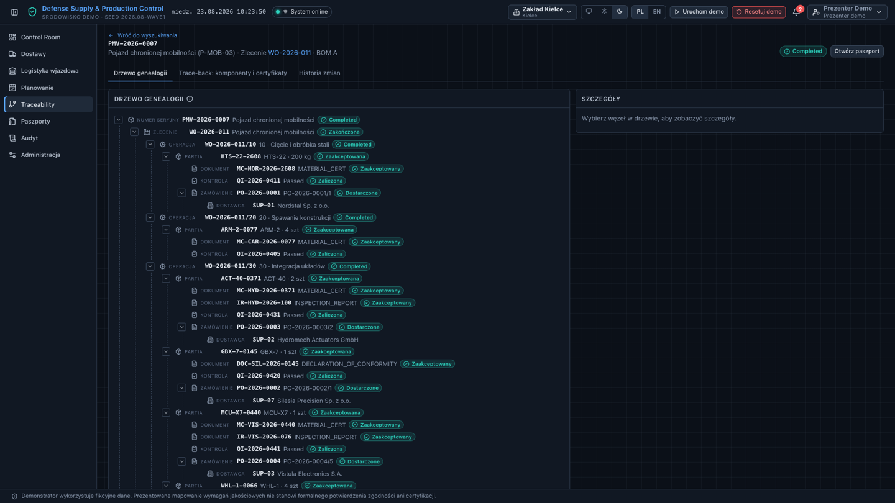

Trace-back od numeru seryjnego wyrobu do dostawcy: `PMV-2026-0007` → zlecenie → operacje → partie
materiałowe → certyfikaty i protokoły kontroli → pozycja zamówienia → dostawca. Każdy dokument ma sumę
kontrolną SHA-256.

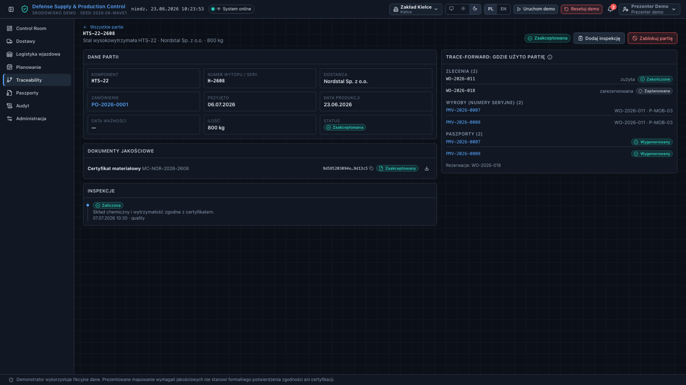

Kierunek odwrotny: dla partii `HTS-22-2608` system pokazuje, gdzie została użyta — zlecenia, numery seryjne
wyrobów i ich paszporty oraz rezerwacje. To ekran, na którym zapada decyzja o blokadzie partii; przycisk
**Zablokuj partię** unieważnia paszporty powiązanych wyrobów.

---

## 5. Wynik — cyfrowy paszport jakościowy


Kompletność liczona wg szablonu `DQP-01`: dziesięć wymagań, każde z dowodem. Obok kod QR prowadzący do
rekordu, lista wersji dokumentu z sumami SHA-256 oraz tabela kluczowych komponentów z partiami, dostawcami
i certyfikatami. Przycisk **Generuj paszport** jest aktywny wyłącznie przy pełnej kompletności — paszport
niekompletny pokazuje konkretną listę braków.

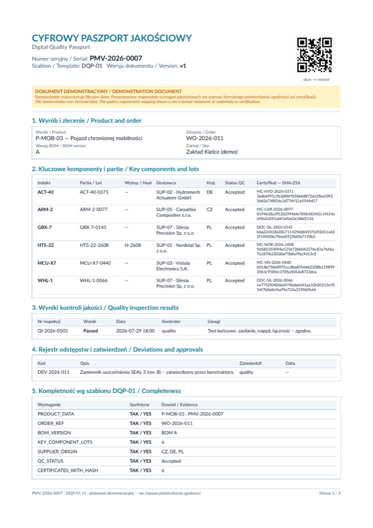

Wygenerowany dokument (2 strony, ok. 80 kB) z kodem QR, sumą kontrolną i klauzulą demonstracyjną w dwóch
językach. Powstaje lokalnie, bez internetu.

---

## 6. Cztery zakłady — cztery historie

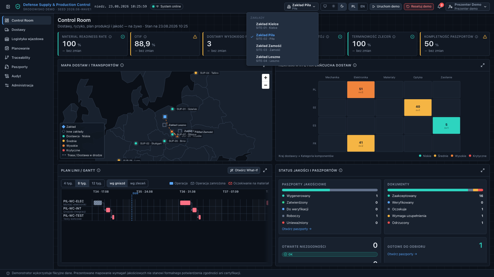

Selektor w pasku górnym przełącza kontekst całej aplikacji. Każdy zakład ma własne gniazda robocze,
zlecenia, dostawy, partie i **scenariusz wiodący**.

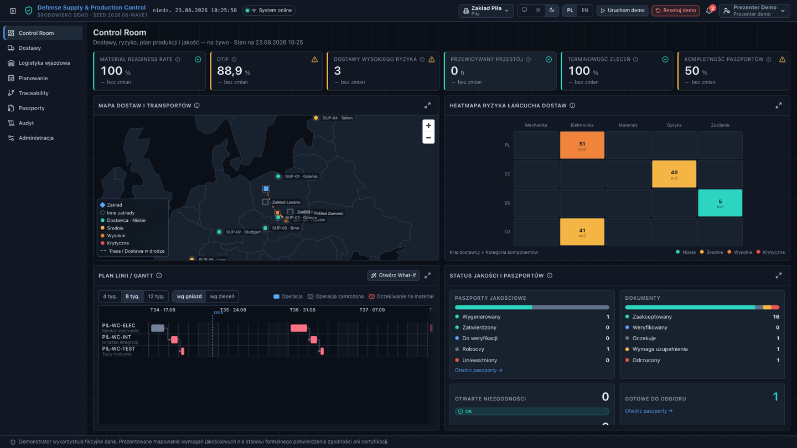

Zakład Piła (elektronika i łączność): inne KPI, inna mapa dostawców, własne gniazda `PIL-WC-*` na Gantcie
i heatmapa zdominowana przez kategorię „Elektronika". Dane zakładów są od siebie odizolowane — również
na poziomie API.

---

## 7. Eksploatacja

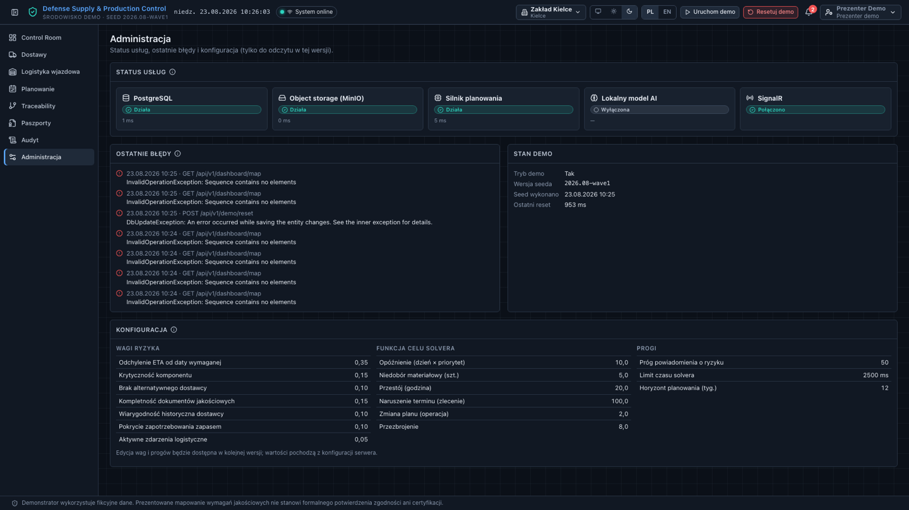

Status usług (PostgreSQL, MinIO, silnik planowania, opcjonalny model lokalny, SignalR) z czasami odpowiedzi,
ostatnie błędy bez ujawniania stack trace, stan danych demonstracyjnych oraz podgląd konfiguracji: wagi
modelu ryzyka, funkcja celu solvera i progi.

---

## 8. Urządzenia mobilne

Interfejs jest w pełni używalny na telefonie — przydaje się, gdy na stoisku podajesz rozmówcy urządzenie
do ręki. Zweryfikowane przy 360, 390, 768 i 1920 px w obu motywach: brak poziomego przewijania strony
i brak ucinanych etykiet.

| Control Room | Lista paszportów | Nawigacja |
|---|---|---|
| 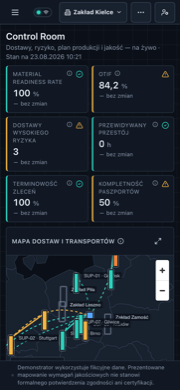 | 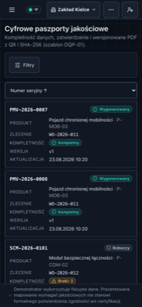 | 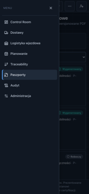 |

Panele układają się w jedną kolumnę, tabele zmieniają się w listę kart, a funkcje, które nie mieszczą się
w pasku (motyw, język, reset demo, powiadomienia, rola), przenoszą się do menu „⋯" — żadna nie znika.
